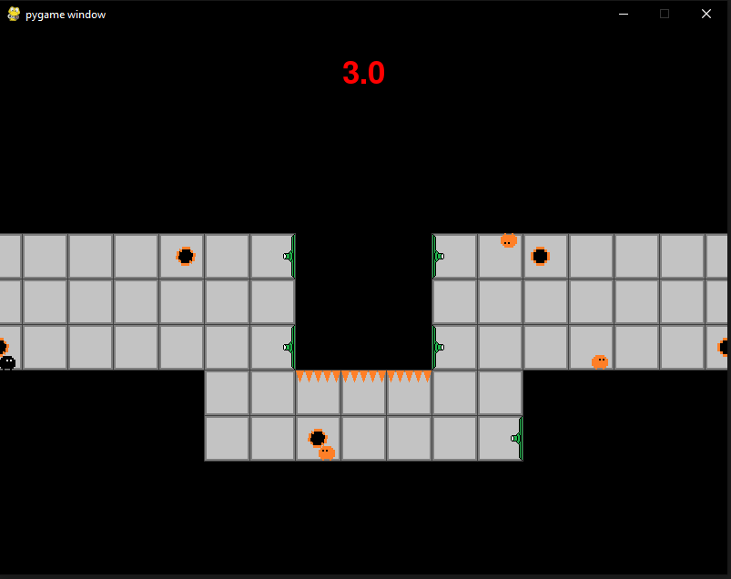

# Broken Gravity

A simple platforming game made in a 24-hour programming competition. Main gimmick is gravity flipping every 3 seconds, requiring precise timing of jumps and strategizing routes through levels.
